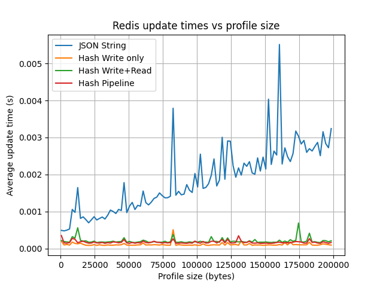

# sample-stand-redis

Minimal Redis stand for local experiments and knowledge refresh.

## Goals
- Quickly spin up Redis locally
- Reproduce common configuration and work patterns
- Experiment with keys, hashes, persistence, TTL

## Requirements
- Docker Engine
- Docker Compose (v2)
- Linux (tested only)

More docs details ->

[Stand state](docs/stand-state.md)

## Experiments

### Redis String vs Hash

This benchmark compares the average execution time of profile update operations in Redis using different data storage approaches as the total profile size increases.

[See more details](docs/redis_string_vs_hash.md)
