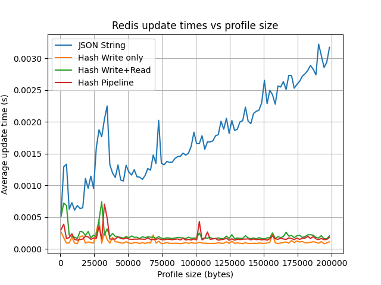
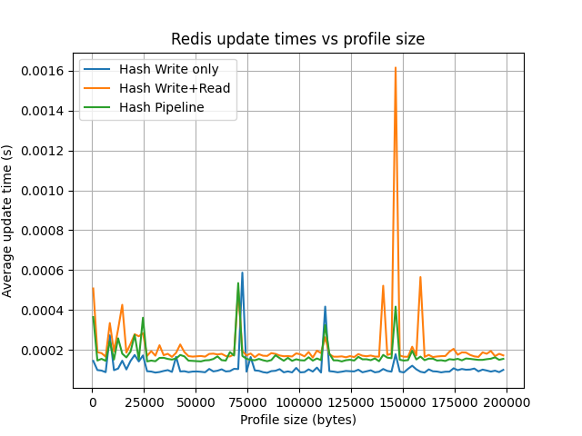

# Redis String vs Hash

## Description*

This benchmark compares the average execution time of profile update operations in Redis using different data storage approaches as the total profile size increases.
The profile contains a fixed set of scalar fields and a variable number of text fields. The total profile size grows by increasing:

* the length of text values
* the number of text fields

The following approaches are measured:

JSON String

Full read → deserialize → update → serialize → write → read

Redis Hash (write only)

HINCRBY without reading the value back

Redis Hash (write + read)

HINCRBY followed by HGET

Redis Hash (pipeline write + read)

HINCRBY and HGET executed in a single pipeline

Each measurement is repeated multiple times, and the average operation time is calculated.

## Results
Profile size vs average operation time

X-axis: total serialized profile size (bytes)
Y-axis: average operation time (seconds)

## Observations

The JSON string approach scales poorly as profile size increases due to full serialization and network transfer.

Redis Hash write-only operations remain almost constant and are the fastest.

Hash write + read is significantly faster than JSON but slower than write-only operations.

Pipelining hash operations reduces network overhead and consistently outperforms non-pipelined write+read.
